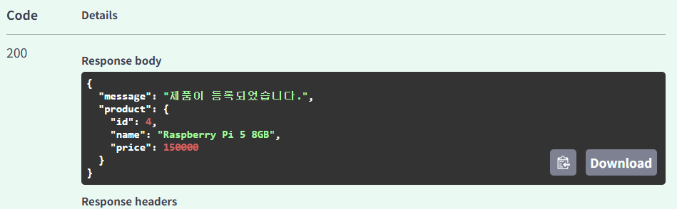
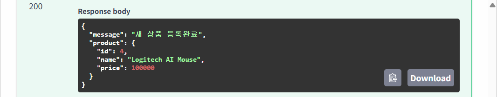
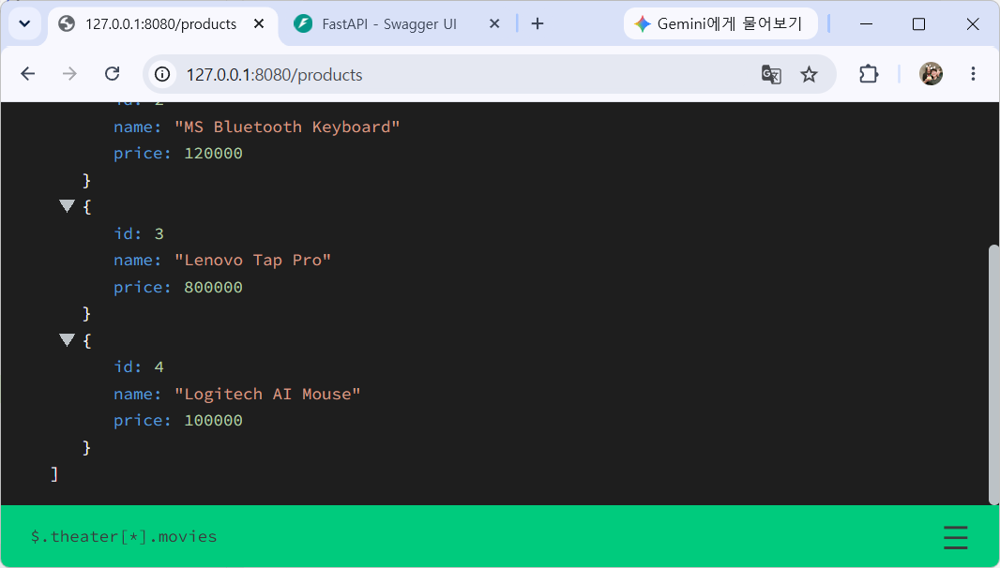
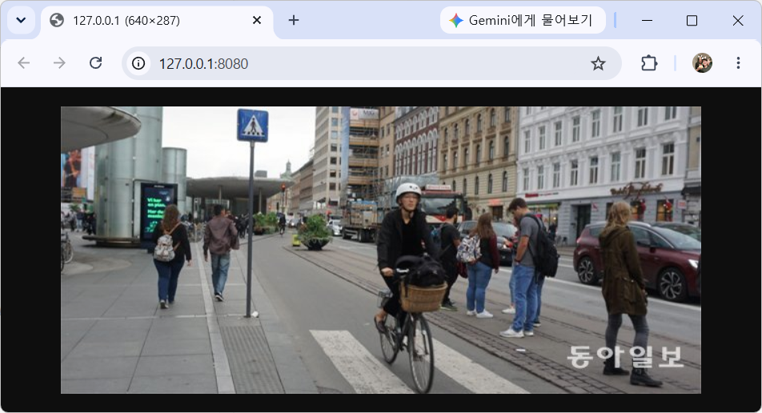
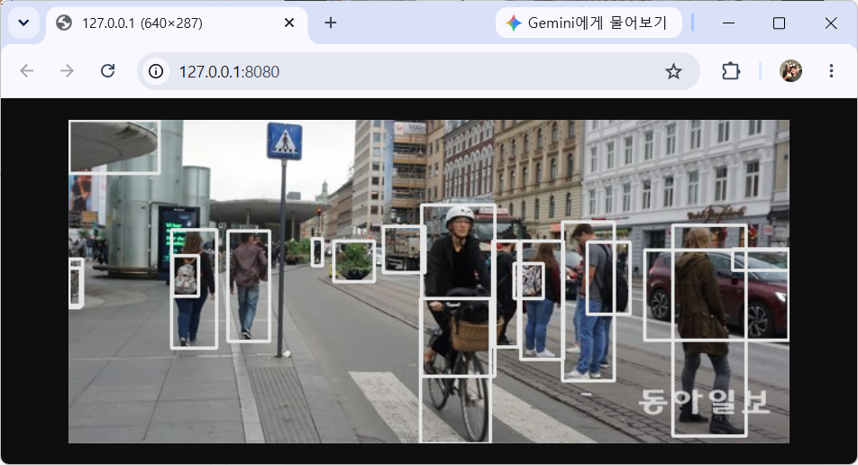
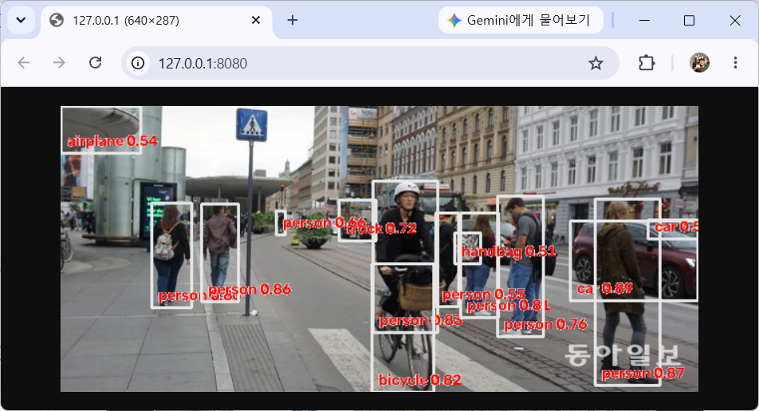

# 토이 프로젝트

출처 : 자바 스프링부트 프로젝트와 파이썬 AI 프로젝트 연결하기(허진경 / 부크크) 

## AI 비전검사 시스템


### Python WebAPI 서비스

- Python 웹 라이브러리/프레임워크
    - Flask - 가볍고 필요한 기능만 제공하는 소규모 프로젝트용 웹. 난이도 중
    - `FastAPI` - REST API에 최적화 된 웹. 매우 빠름, 난이도 중
    - Django - 모든 기능을 제공하는 대형 프레임워크. 난이도 상
    - Pyramid - 중대형 프로젝트용 프레임워크. 난이도 상
    - Falcon - REST API 전용
    - Bottle - 초경량. 난이도 하

- 웹 서버(실행 서버)
    - `Uvicorn` - FastAPI 실행 서버

#### 파이썬 가상환경 설치

- 프로젝트 루트 폴더(디렉토리)에 가상환경 설치

```powershell
> python -m venv venv
> .\venv\Scripts\activate.ps1
```

- .gitignore에 python 관련 설정 추가

#### 기본 패키지 설치

```powershell
> pip install fastapi uvicorn
```

#### FastAPI 기본

- 기본 서버 : [소스](./toyproject/ToyProjects04/pythonAi/main01.py)

- 서버실행 1

```powershell
> fastapi dev main01.py
```

- `서버실행 2`

```powershell
> uvicorn main01:app --reload [--port 8000]
```

- `서버실행 3` - 디버깅까지 가능함. 파이썬 소스에 main 엔트리 로직 추가

```powershell
> python main01.py
```


#### FastAPI docs

- Swagger UI - PostMan과 동일한 기능 웹페이지
- http://127.0.0.1:8000/docs
    
#### Get Method 처리 API 

- Get method : [소스](./toyproject/ToyProjects04/pythonAi/main02.py)

#### FastAPI 디버그모드

- 아래 코드 추가 후 디버깅 시작으로 실행
- 디버깅 가능

```python
import uvicorn

if __name__ == '__main__':
    uvicorn.run('main02:app', host='127.0.0.1', port=8000, reload=True)
```

#### 쿼리스트링

- URL 뒤 ?변수명=값&변수명=값 : [소스](./toyproject/ToyProjects04/pythonAi/main03.py)


#### Pydantic 모델 사용

- POST 요청으로 JSON을 데이터를 받을때 사용하는 모델 패키지. C# Newtonsoft.Json과 동일한 역할 : [소스](./toyproject/ToyProjects04/pythonAi/main04.py)



- 데이터 입력시 Validation 체크 

```json
{
  "id": 4,
  "name": "Test",
  "price": 1000
}
```


- products 배열(리스트)에 제품 등록





#### Put/Delete 메서드 처리 API

- 나중에...

### Python AI 물체인식

- OpenCV + PyTorch + YOLO

```powershell
(venv) PS > pip install opencv-python
(venv) PS > nvidia-smi
----------------------------------------+
...              CUDA Version: 13.1     |
-----------------+----------------------+

(venv) PS > pip install torch torchvision --index-url https://download.pytorch.org/whl/cu130
(venv) PS > pip install ultralytics
(venv) PS > pip install python-multipart
```

#### 기본 API 서비스 

- 비전용 FastAPI 서비스 - [소스](./toyproject/ToyProjects04/pythonAi/main05.py)

#### 기본 이미지 출력

```python
@app.get('/')
async def root():
    image = Image.open('./test01.png')  # PILLOW 패키지로 이미지오픈 메모리업로드

    return FileResponse('./test01.png', media_type='image/png')
```



#### Pillow 오픈 뒤 전송

```python
@app.get('/')
async def root():
    image = Image.open('./test01.png')  # PILLOW 패키지로 이미지오픈 메모리 업

    buffer = BytesIO()
    image.save(buffer, format='PNG')
    buffer.seek(0)

    return StreamingResponse(buffer, media_type='image/png')
```

#### YOLO 물체인식

- detectObjects() : [소스](./toyproject/ToyProjects04/pythonAi/main05.py)



- 신뢰도 표시



#### 결과이미지 타서버 요청및 인식결과 응답

- Post 함수 : [소스](./toyproject/ToyProjects04/pythonAi/main05.py)
- 타 서버에서 이미지 객체 인식을 요청해서, 인식된 결과를 돌려주는 작업


### ASP.NET Core WebAPI

### 동영상, 웹캠 실시간 객체인식

### 비전검사