# 토이프로젝트 6

## 컨베이어벨트 공정관리 시스템 2

### ESP32-CAM

#### 개요

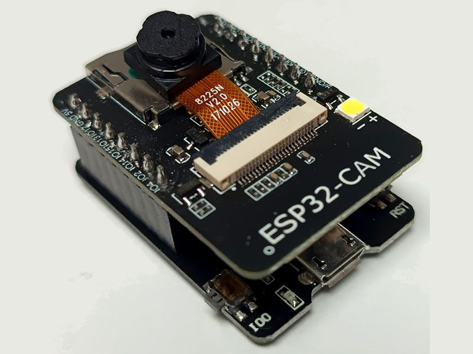

**Ai-Thinker ESP32-CAM**

ESP32 기반 프로세서 사용, WiFi, 블루투스를 지원하는 아두이노 호환보드

업로드 모듈을 사용안할 경우, 아래와 같이 브레드보드, USB 모듈을 직접 연결해야 함

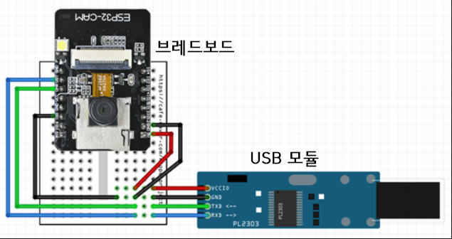

#### 기본사용 일부

- Bluetooth 4.2, BLE
- WiFi 802.11 전부 가능
- USB b타입 지원
- microSD 4G 까지 지원 - 사용할 필요 없음
- 외부 안테나 연결 가능

#### 활용처

- 카메라 촬영
- 실시간 영상 스트리밍
- Wi-Fi 통신
- 자체 웹 서버 기능
- 간다한 영상/물체 감지
- IoT 기능도 포함
- UART - Arduino, Raspberry Pi 와 시리얼 통신

##### ESP32-CAM 사용이유

- 라즈베리파이 직접 카메라를 장착하려면 - RPi Camera 또는 USB 웹캠 가능
- 컨베이어벨트 등 산업장비에 설치, 독립적으로 스트리밍을 가능하게 하기 위해서 사용
- 저사양으로 테스트용으로 사용 실제 산업현장용은 고비용 고사양


#### 개발환경 설정

`Arduino ID`E 나 `Visual Studio Code - Platform IO` 확장으로 사용등 여러방법 존재

##### VS Code - PlatformIO IDE

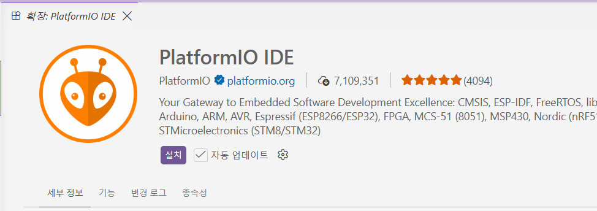

- VS Code 확장 `Platform IDE` 검색
- Install
- Python 설치되어 있지 않으면 병행 설치 됨
- 새로 리로드 필요

##### PlatformIO IDE 프로젝트 생성

1. PlatformIO 아이콘 클릭(pio)
2. Quick Access 에서 New Project 선택

   - 프로젝트 명, Board AI Thinker ESP32-CAM, Framework Arduino 선택
   - 프로젝트 소스 저장위치 선정
   - Finish 클릭

   

##### PlatformIO 프로젝트 구조

- 프로젝트 폴더 구조
  - include : 헤더파일 위치
  - lib : 외부라이브러리 저장
  - src : cpp파일 위치
  - test : 단위테스트용
  - platformio.ini : 사용할 보드 설정

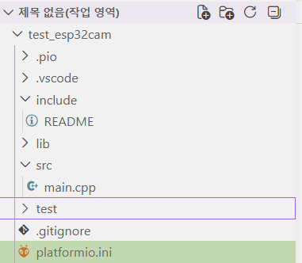

- 프로젝트 태스크 구조
  - Build : 빌드 컴파일
  - Upload : 보드 업로드
  - Monitor : 시리얼 모니터
  - Upload and Monitor : 업로드 후 시리얼 모니터 오픈
  - Clearn / Full Clearn : 소스 정리
  - Devices : 보드 정보 확인


- 윈도우 장치 관리자에서 시리얼포트 확인, 라즈베리파이에서는 /dev/ttyUSB*

##### ESP32-CAM 동작확인


- [platformio.ini](./toyproject/ToyProjects06/platformio_part/test_esp32cam/platformio.ini) 작성 - 버전 변경후 저장, 프로젝트 재구성 시간소요
- 기본동작 소스 작성

```cpp
#include <Arduino.h>

void setup() {
  Serial.begin(115200);

  delay(2000);

  Serial.println();
  Serial.println("ESP32-CAM START");
}

void loop() {
  Serial.println("ESP32 alive!");

  delay(1000);
}
```

- PlatformIO 프로젝트 태스크 > Build 클릭
- 빌드 성공하면 [SUCCESS] 출력
- Upload 클릭, 최초 업로드시 Tool Manager 다운로드 설치 시간 소요

  
- 업로드 % 가 표시

* 프로젝트 태스크 > Monitor 클릭
* ESP32-CAM 보드 > RST 버튼 클릭 초기화
* 

##### 기본 명령어

- 빌드 : `platformio run`
- 실제 : `platformio.exe run --environment esp32cam`
- 빌드 + 업로드 : `platformio run --target upload`
- 시리얼 모니터 : `platformio device monitor`
- Clean : `platformio run --target clean`

##### ESP32-CAM 웹서버 예제

- [소스](./toyproject/ToyProjects06/platformio_part/test_esp32cam/src/main.cpp)
- 빌드, 업로드 후 모니터
- 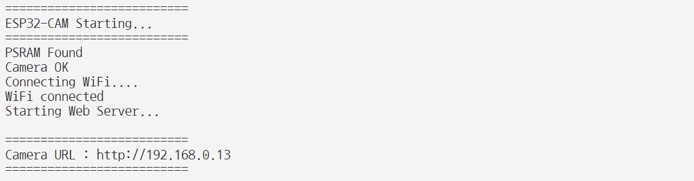
- 테스트

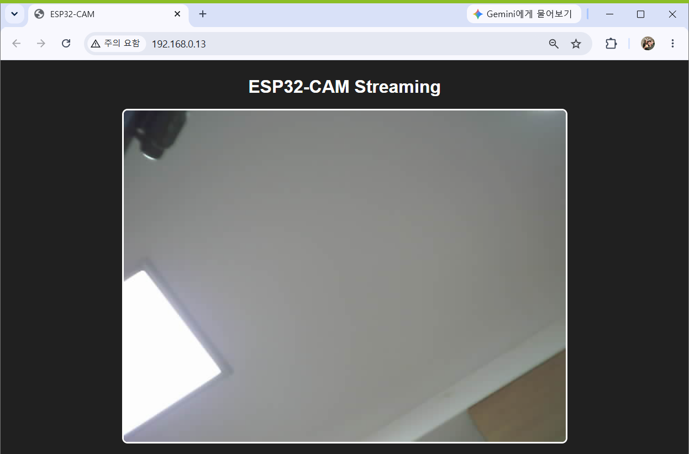

##### 특이사항

- ESP32-CAM 저사양으로 한번에 여러개 접속이 불가능
- WiFi 2.4GHz 만 지원 (5G 이상 접속 불가)
- 웹브라우저 오픈 + Python YOLO 동시에 처리하면 스트리밍 끊김
- TinyML 이라는 머신러닝 라이브러리로 AI 처리 가능 - 느려서 사용어려움
- ESP32-CAM은 영상만 스트리밍, 물체인식 등 라즈베리파이에서 Python으로 처리

#### Python OpenCV, YOLO 연계

- 기본적인 [OpenCV 소스](./toyproject/ToyProjects06/raspberrypi_part/test_opencv.py) 동작 확인
- 기본적인 [YOLO 소스](./toyproject/ToyProjects06/raspberrypi_part/test_yolo.py) 동작 확인


- 색상으로 인식할 모델 생성 또는 검색

#### ESP32-CAM 전원만 인가

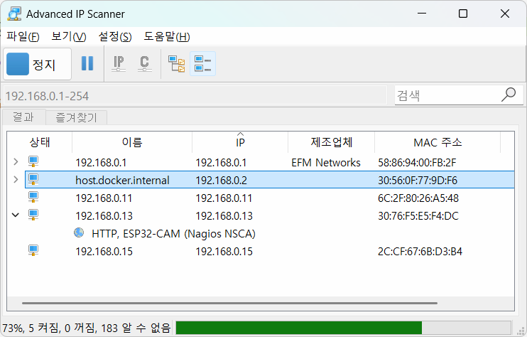

ESP32-CAM 동작확인

#### 라즈베리파이 + ESP32-CAM

* 윈도우에서 ESP32-CAM 빌드, 업로드한 보드가 라즈베리파이에서 동작 실패(!)
* 컬러센서에서 인식하는 부분에 카메라 위치

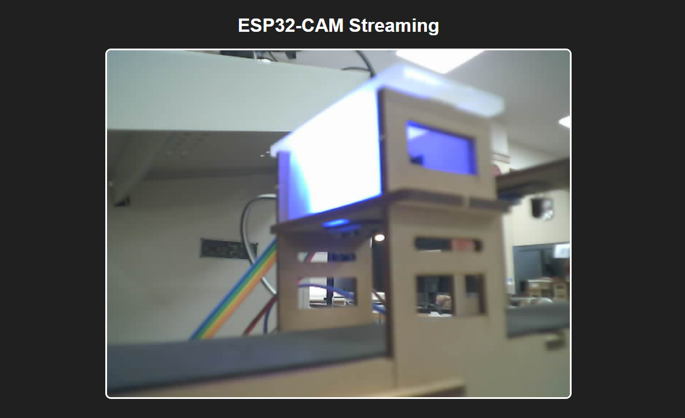

### 물체인식 기능 추가

#### Raspberry Pi Global Python에 PIP 라이브러리 설치방법

- 라즈비안 Wormbook부터 글로벌 Python은 PIP 로 라이브러리 설치가 금지(방지)

```bash
$ pip install numpy
error: externally-managed-environment
```

- 위 명령을 무시하고 설치하고자 하면

```bash
# 1번째 방법
$ sudo rm /usr/lib/python3.13/EXTERNALLY-MANAGED
# 삭제 후 
$ pip install numpy
# 2번째 방법
$ pip install numpy --break-system-packages
```

#### Raspberry Pi YOLO 설치시 주의점

- YOLO 설치 (Python 가상환경)를 아래와 같이하면
  - YOLO로 자동설치되는 PyTorch는 GPU버전이 설치됨
  - ARM64 버전에 Nvidia Jetson Nano 들은 GPU가 설치되어 있음
  - MicroSD 32G에서는 pip 캐시 저장용량, ssd tmp 드라이브 용량이 모자람

```bash
(.venv) $ pip install opencv-python
(.venv) $ pip install ultraytics # YOLO 설치 하면서 PyTorch 같이 설치
```

- Raspberry pi에서 YOLO를 설치하려면 아래의 명령으로 진행할 것

```bash
(.venv) $ pip install opencv-python
(.venv) $ pip install torch torchvision --index-url https://download.pytorch.org/whl/cpu
(.venv) $ pip install ultraytics # YOLO 만 설치
```

#### YOLO 물체인식

- ESP32-CAM으로 컬러센서 대신 물체인식 변경
- YOLO에서 사용할 커스터마이징 모델 훈련, 생성
- 현재 벨트상황에서 훈련시킬 물체 사진 캡쳐
  - 최소 색상별(Red, Green, Blue) 100장 이상 캡처

#### ESP32-CAM 캡처 기능

- 보드 재부팅 현상 발생
- 보류

#### Python OpenCV 캡처 기능

- [소스](./toyproject/ToyProjects06/raspberrypi_part/test_capture.py)

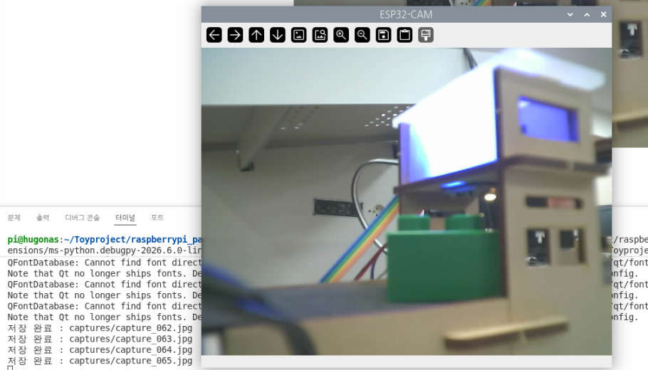

#### YOLO Pretrained Model 생성

생산품 색상별 인식할 수 있는 YOLO 모델 생성해야 함.

YOLO 커스텀 학습이 필요.

1. 이미지 셋 준비 (색상별 100장 이상)
2. **라벨링**
3. `YOLO 형식에 맞게 export`
4. 데이터셋 폴더 구성 - Train 폴더 / Validation 폴더
5. data.yaml 작성
6. YOLO로 학습

##### 라벨링 툴

- [Roboflow](https://roboflow.com/) - 유료 라벨링 사이트
- [cvat.ai](https://www.cvat.ai/) - 유료 라벨링 사이트. export 시 결재 팝업
- [labelImg](https://github.com/HumanSignal/labelImg) - 무료툴 Github 오픈소스

##### LabelImg 툴 사용 라벨링


##### YOLO 학습 폴더(데이터셋) 구성

- YOLO 학습을 위한 데이터셋 구성

  - train : val - 8 : 2 로
  - images > train, val
  - labels > train, val

  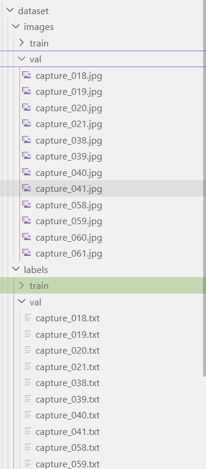
- data.yaml 작성

##### YOLO 학습

- `Fine-tuning` : 기존 yolo11n.pt 사전학습 모델을 가져와서 필요한 Red/Green/Blue 데이터로 재학습
- YOLO 사전학습 모델 기반으로 학습
  - data.yaml 절대경로로 작성
  - Utralytics 패키지 폴더 settings.json 파일 내
    - 윈도우 경우 C:\Users\User\AppData\Roaming\Ultralytics\settings.json
    - `datasets_dir` 경로 훈련시킬 데이터셋 경로로 지정, weights_dir, russ_dir

```bash
yolo detect train data=C:/..../python_folder/data.yaml model=yolo11n.pt epochs=100 imgsz=640
```


- 훈련 진행 중 화면


- 결과 화면. 모델파일 위치 확인


- 훈련 중간 배치 이미지 확인
- 훈련모델 물체인식 테스트

```powershell
(venv) PS C:\...\iot-dotnet-2026> yolo detect predict model=../runs/detect/train-5/weights/best.pt source=.\toyproject\ToyProjects06\raspberrypi_part\dataset\images\val\capture_018.jpg
Ultralytics 8.4.102  Python-3.12.10 torch-2.13.0+cu130 CUDA:0 (NVIDIA GeForce RTX 5060, 8151MiB)
YOLO11n summary (fused): 101 layers, 2,582,737 parameters, 0 gradients, 6.3 GFLOPs

image 1/1 C:\...\iot-dotnet-2026\toyproject\ToyProjects06\raspberrypi_part\dataset\images\val\capture_018.jpg: 480x640 1 red, 35.3ms
Speed: 1.2ms preprocess, 35.3ms inference, 10.0ms postprocess per image at shape (1, 3, 480, 640)
Results saved to C:\SourceBank\runs\detect\predict-5
 Learn more at https://docs.ultralytics.com/modes/predict
VS Code: view Ultralytics VS Code Extension  at https://docs.ultralytics.com/integrations/vscode
```

##### 라즈베리파이 실시간 확인

- best.pt 파일 이전
- test_yolo.py 실행

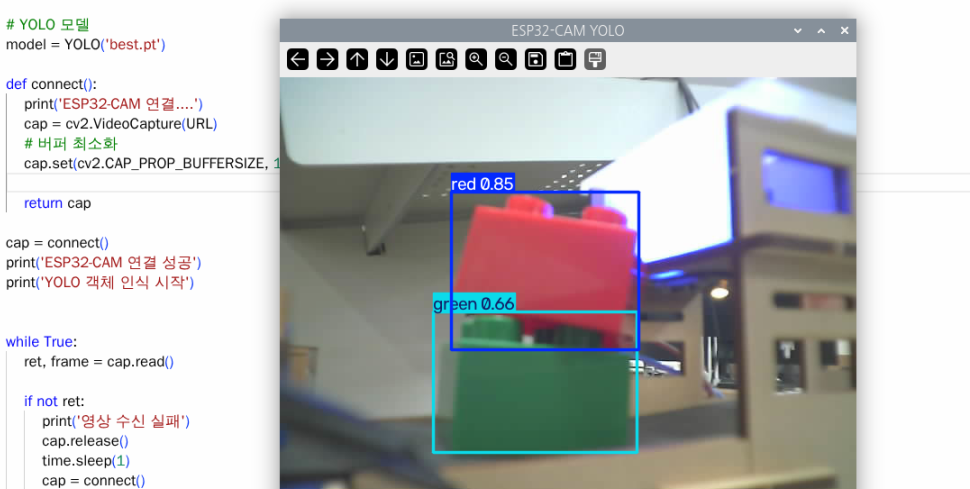

- 실시간 물체인식 확인

### 기존 컨베이어벨트 키트와 통합

#### OS 부팅시 자동실행 처리

- 라즈베리파이에서 부팅 후 자동프로그램 실행
- 자동 실행 방법
  - `.bashrc` : 터미널 열 때 마다 실행. 항상 일정. ROS2 시스템 초기화 사용
  - Autostart : GUI 로그인 후 실행. 라즈비안 버전마다 명령어가 변경
  - crontab @reboot : 일정시간마다 실행되도록 하는 명령 포함
  - systemd : 부팅 자동실행, 재시작, 로그 관리

##### Autostart 실행 방법

- 라즈비안 버전 마다 상이
- ~~/etc/xdg/lxsession/rpd-x/autostart~~ 사용 불가
- labwc 윈도우 매니저 방식의 autostart 사용
- 프로젝트 폴더에 실행용 쉘 `startup.sh` 생성
- `sudo nano ./startup.sh` 실행, 아래 내용 작성

```shell
#!/bin/bash

sleep 5

cd /home/pi/Toyproject/raspberrypi_part/

echo "=============================="
echo " Data Interface 자동 실행     "
echo "=============================="

source .venv/bin/activate  

echo "Python 가상환경"
which python

echo "프로그램 실행"

python -u data_interface.py

echo "프로그램 종료"
read

```

- startup.sh 에 실행권한 추가 및 파일 소유자 변경

```bash
$ sudo chmod +x ./startup.sh   # 실행권한 추가
$ sudo chown pi:pi startup.sh  # 파일 소유자 변경
```

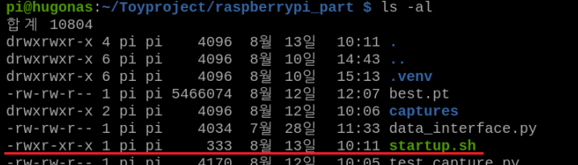

- 사전 테스트 : 재부팅 전에 동작 확인


- autostart 파일 추가

```bash
$ mkdir -p ~/.config/labwc
$ nano ~/.config/labwc/autostart

# autostart 파일 내 아래 명령어 추가 후 저장
lxterminal -e /home/pi/Toyproject/raspberrypi_part/startup.sh &

```

- 재부팅 확인
  - 컨베이어 벨트 : 추가 전원으로 계속 동작
  - ESP32-CAM : 전원들어오면 먼저 웹서버 실행
  - MQTT, YOLO Python : 라즈비안 부팅 완료 후 실행

##### systemd 서비스로 자동 실행

- /etc/systemd/system 아래 다른 서비스 확인


- service 파일 생성

```bash
$ sudo nano /etc/systemd/system/datainterface.service
```

```ini
[Unit]
Description=Python MQTT Service
After=network.target

[Service]
Type=simple
User=pi
WorkingDirectory=/home/pi/Toyproject/raspberrypi_part

ExecStart=/home/pi/Toyproject/raspberrypi_part/startup.sh

Restart=always
RestartSec=5

[Install]
WantedBy=multi-user.target
```

- systemd 에 새 서비스 알려주기

```bash
$ sudo systemctl daemon-reload
```

- 부팅 자동실행 등록 및 해제

```bash
$ sudo systemctl enable datainterface.service
$ sudo systemctl disable datainterface.service
```

- 사전 테스트

```bash
$ sudo systemctl start datainterface.service
$ sudo systemctl status datainterface.service
● datainterface.service - Python MQTT Service
     Loaded: loaded (/etc/systemd/system/datainterface.service; enabled; preset: enabled)
     Active: active (running) since Thu 2026-08-13 11:15:45 KST; 19s ago
 Invocation: 3661f6daef644b8190198c11756c8b2c
   Main PID: 2579 (startup.sh)
      Tasks: 3 (limit: 4805)
        CPU: 137ms
     CGroup: /system.slice/datainterface.service
             ├─2579 /bin/bash /home/pi/Toyproject/raspberrypi_part/startup.sh
             └─2582 python -u data_interface.py

 8월 13 11:15:45 hugonas startup.sh[2579]: Python 가상환경
 8월 13 11:15:45 hugonas startup.sh[2581]: /home/pi/Toyproject/raspberrypi_part/.venv/bin/python
...
$ sudo systemctl stop datainterface.service
```

- 재부팅 후 확인
  - 로그 출력은 되나 systemctl status를 다시 실행해야 최신로그 확인됨

##### 결론

autostart 사용할 것

#### YOLO + MQTT 통합, 아두이노 제어

- 컨베이어 벨트에서 컬러센서로 색상 판별
- YOLO로 변경
  - YOLO에서 감지한 색상을 시리얼통신으로 아두이노로 전달
  - MQTT로 데이터 배포
- 아두이노 시리얼통신으로 YOLO 값 수신
- 색상별 각도 조절, 벨트 동작

##### YOLO 물체 감지영역 변경

- ROI(Region Of Interest) : 관심영역으로 물체 인식 범위 지정
- ROI 영역을 벗어나면 물체 인식 안됨

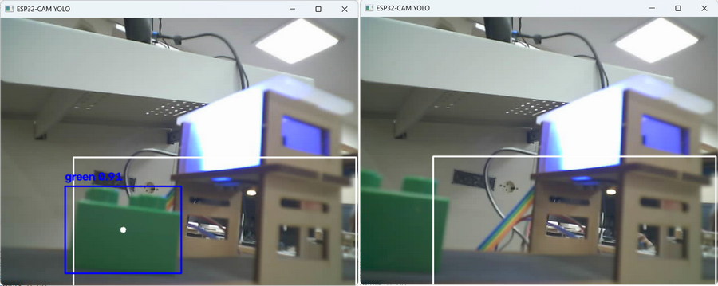

##### Python YOLO 소스와 MQTT 통신 소스 통합

- data_interface.py 와 test.yolo,py 소스 통합
- 물체 인식 동시에 MQRR로 데이터 Publish
- total_interface.py


- 물체인식 가능, MQTT 물체 Detect 이후 값 전달 안됨 -> 벨트 중지
- 전달 위한 publish_yolo_data() 함수 작성

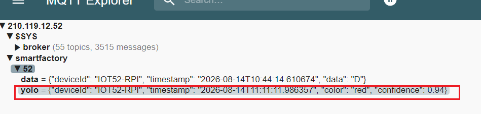

- 1초에 수번 ~ 수십번 MQTT 배포를 하는 상황

##### Python 에서 Arduino로 시리얼통신 전송

- 클래스 명에 따라 R, G, B로 시리얼

##### Arduino 수신된 값으로 서보모터 제어

- 아두이노 소스에 processSerialCommand(char command), setProductColor(char color) 함수 추가
- sortingmachine.ino

##### 실행결과


#### Unity에서 컨베이어벨트 비상정지 제어


TODO : 유니티에서 컨베이어벨트 제어
